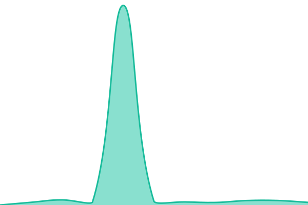

# [📈 Live Status](https://status.ohelit.co): <!--live status--> **🟧 Partial outage**

This repository contains the open-source uptime monitor and status page for [Upptime](https://upptime.js.org), powered by [Upptime](https://github.com/upptime/upptime).

With [Upptime](https://upptime.js.org), you can get your own unlimited and free uptime monitor and status page, powered entirely by a GitHub repository. We use [Issues](https://github.com/upptime/upptime/issues) as incident reports, [Actions](https://github.com/ohelitco/upptime/actions) as uptime monitors, and [Pages](https://status.ohelit.co) for the status page.

<!--start: status pages-->
<!-- This summary is generated by Upptime (https://github.com/upptime/upptime) -->
<!-- Do not edit this manually, your changes will be overwritten -->
<!-- prettier-ignore -->
| URL | Status | History | Response Time | Uptime |
| --- | ------ | ------- | ------------- | ------ |
|  [Muysc](https://muysc.ohelit.co) | 🟩 Up | [muysc.yml](https://github.com/ohelitco/status/commits/HEAD/history/muysc.yml) | 

 325ms
     
 | 

<a href="https://estado.ohelit.co/history/muysc">95.61%</a>
    

|  [Reportes](https://repository.ohelit.co/jasperserver/login.html) | 🟩 Up | [reportes.yml](https://github.com/ohelitco/status/commits/HEAD/history/reportes.yml) | 

 496ms
     
 | 

<a href="https://estado.ohelit.co/history/reportes">95.62%</a>
    

|  [Auth](https://auth.ohelit.co/auth/) | 🟩 Up | [auth.yml](https://github.com/ohelitco/status/commits/HEAD/history/auth.yml) | 

 872ms
     
 | 

<a href="https://estado.ohelit.co/history/auth">95.62%</a>
    

|  [Class](https://class.ohelit.co/) | 🟥 Down | [class.yml](https://github.com/ohelitco/status/commits/HEAD/history/class.yml) | 

 0ms
     
 | 

<a href="https://estado.ohelit.co/history/class">0.00%</a>
    

<!--end: status pages-->

[**Visit our status website →**](https://status.ohelit.co)

## 📄 License

- Powered by: [Upptime](https://github.com/upptime/upptime)
- Code: [MIT](./LICENSE) © [Upptime](https://upptime.js.org)
- Data in the `./history` directory: [Open Database License](https://opendatacommons.org/licenses/odbl/1-0/)
